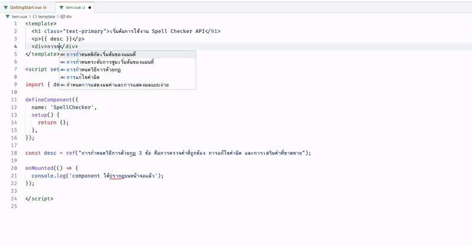
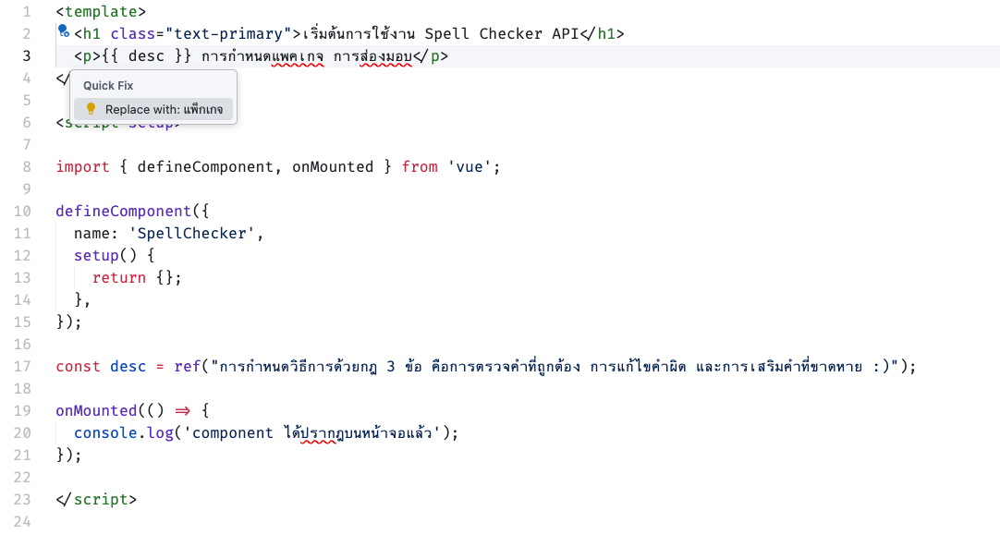

# Longdo Spell Checker for VS Code 

A VS Code extension that integrates the Longdo Spell Checking service for Thai language text.





### Features 💕

* Quick fix suggestions for correcting Thai spelling errors
* Comprehensive Thai spell checking
* Support for multiple Thai document types
* Customizable settings

### Installation ⚒️

Search for "Longdo Spell Checker" in the VS Code Extensions marketplace or install using the command:

```
ext install longdo-spell
```

### Language Support

| Language | Support Level |
|----------|---------------|
| Thai     | Full          |
| English  | None          |

### Files Extension Support

| Language           | Support Level |
|--------------------|---------------|
| Javascript .js     | ✅            |
| Python  .py        | ✅            |
| PHP .php           | ✅            |
| Vue .vue           | ✅            |
| go  .go            | ✅            |
| JSON   .json       | ✅            |
| HTML   .html       | ✅            |


### ข้อกำหนดการใช้งาน 
เนื่องด้วยในการตรวจคำจำเป็นต้องใช้ Server ในการประมวลผล ซึ่งจำเป็นต้องมี API Key ก่อนครับ สมัครได้ที่ [Longdo Console](https://map.longdo.com/console/) และ **ทั้งหมดนี้ ฟรี !!**. ครับ
แต่ก็มีจำกัดบ้าง คือ 100,000 ครั้งต่อเดือน กล่าวคือใช้คำสั่งตรวจได้ 100,000 ครั้ง แต่ถ้าข้อความเรายาวจริง ๆ ที่มากกว่า 1024 ตัวอักษร ก็ตัดไปเป็นอีก 1 Request ให้ครับ เช่น พิมพ์ยาวมากเลยเป็นเรียงความ นับได้ 1025 ตัว ก็ตัด 1024 ตัวไปถาม 1 ครั้ง อีก 1 ตัวที่เหลือก็ยิงไปถามอีก 1 ครั้งรวมเป็น 2 แอบไม่คุ้มแต่ก็คิดว่าใช้ยังไงก็น่าจะไม่หมดถ้าไม่ถล่ม


### Build Status


